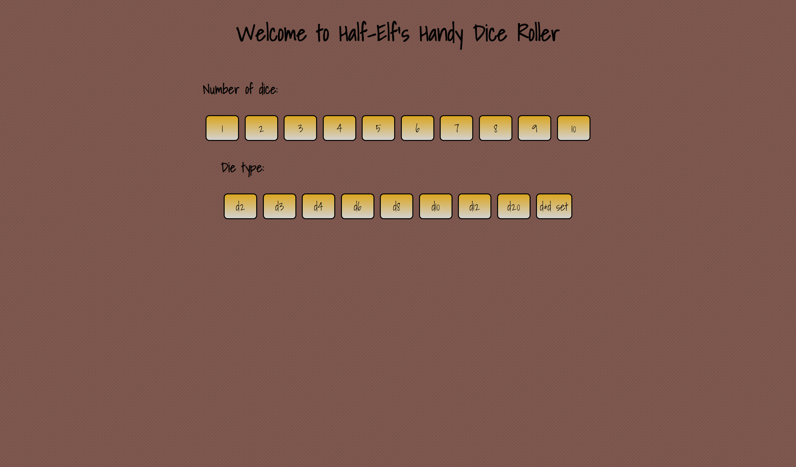

# Half-Elf's Handy Dice Roller

## Table of Contents

* [Description](#description)
* [Links](#links)
* [Screenshots](#screenshots)
* [Installation Instructions](#installation-instructions)
* [Usage](#usage)
* [Technologies Used](#technologies-used)
* [Tests](#tests)
* [Credits](#credits)
* [Contributing](#contributing)
* [Questions](#questions)
* [Badges](#badges)

## Description

This application will allow the user to roll virtual dice with the tap of a button. The user will be able to select how many dice, between 1 and 10; how many sides: 2, 3, 4, 6, 8, 10, 12, 20; and will have the option of rolling a standard 7-dice DnD set together ... because of course you want to see that!

## Links

[Deployed application on Heroku](https://#) NOT DEPLOYED YET

## Screenshots

Landing page:

1 d6:

Full 7-dice set:

Ten d4s:

## Installation Instructions

npm install

## Usage

This project is intended to be used anytime a dice roll is called for, but you don't have any dice.

## Technologies Used

React, Node.js, TypeScript

## Tests

npm run test

## Credits

N/A

## Contributing

We believe code is never finished, and welcome your contributions to enhance the application's functionality. Please adhere to the Code of Conduct for the Contributor Covenant, version 2.0, at https://www.contributor-covenant.org/version/2/0/code_of_conduct.html.

## Questions

If you have further questions, you can reach me at lauracole1900@comcast.net. For more of my work, see [my GitHub](https://github.com/LauraCole1900).

## Badges

 